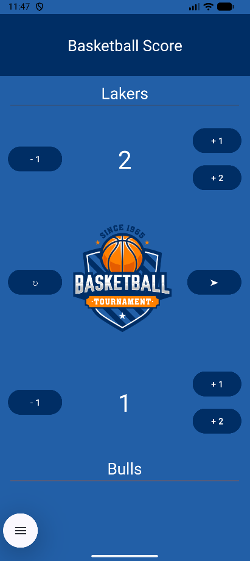
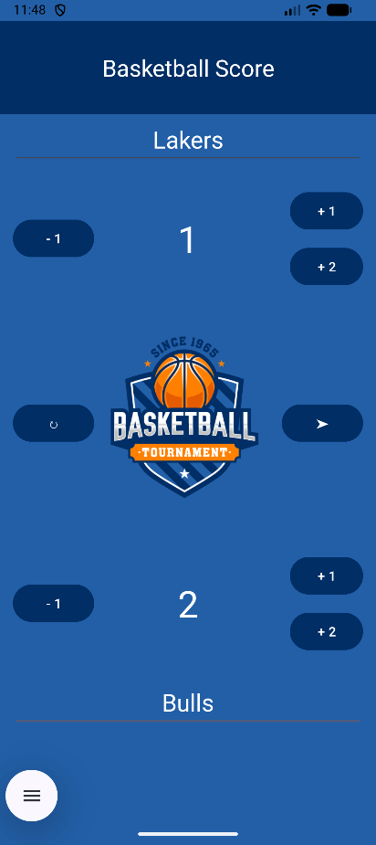
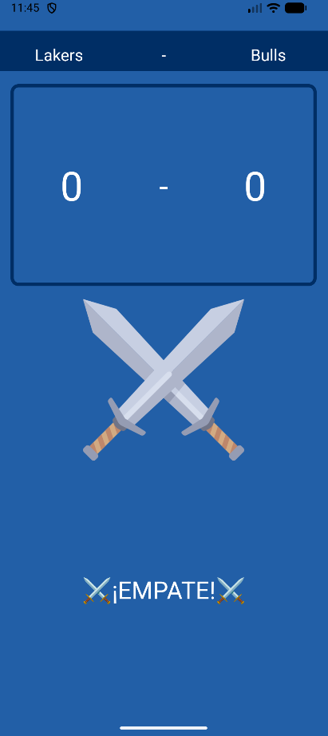
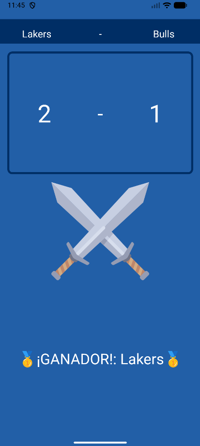
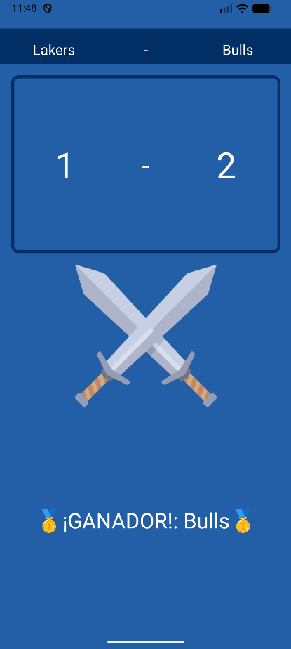

# 🏀 Basketball Score App – Proyecto Final 1.º Trimestre

Autor: [Tu Nombre]
Curso: 1.º Trimestre – Desarrollo Android
Proyecto: Gestión de marcador de partidos de baloncesto

## 📌 Descripción del Proyecto

Basketball Score es una aplicación Android que permite gestionar el marcador de un partido de baloncesto en tiempo real.
Incluye dos pantallas principales:

- MainActivity – Gestión de puntuación: suma, resta y reinicio de puntos.

- ScoreActivity – Visualización de resultados finales y determinación automática del ganador o empate.

El proyecto demuestra conocimientos de Views, Layouts, Data Binding, Intents explícitos y buenas prácticas de desarrollo Android.

## 🖼️ Capturas de Pantalla

- Pantalla Principal – MainActivity

- Pantalla de Resultados – ScoreActivity

## 🏗️ Arquitectura de la Aplicación

### MainActivity:

- Contadores dinámicos de puntos (+1, +2, -1)

- Botón Reiniciar para restablecer puntos a 0 🔄

- Botón Siguiente para navegar a ScoreActivity ➡️

### ScoreActivity:

- Muestra los puntos finales en formato X - Y

- Determina automáticamente el ganador o empate

## 🛠️ Tecnologías y Conceptos Usados

- Android Studio

- Java y Data Binding 📌

- Layouts: RelativeLayout (MainActivity) y RelativeLayout + TextView (ScoreActivity)

- Intents explícitos para pasar datos entre Activities

- Strings.xml y recursos de colores para mantener buena organización

- Validación de puntos (no negativos)

- Bordes y estilos mediante drawables XML

## ⚡ Funcionalidades Principales

✅ Sumar y restar puntos de ambos equipos

✅ Validación para evitar valores negativos

✅ Reinicio completo del marcador

✅ Navegación entre pantallas con paso de datos usando Intent.putExtra

✅ Mensajes dinámicos de ganador o empate con emojis

✅ Data Binding para acceso seguro a todas las vistas

## 📌 Constantes y Buenas Prácticas

Se han definido constantes para las claves de Intent, evitando strings repetidos:

public static final String EXTRA_LOCAL_NAME = "NOMBRE_LOCAL";
public static final String EXTRA_VISITANTE_NAME = "NOMBRE_VISITANTE";
public static final String EXTRA_PUNTOS_LOCAL = "PUNTOS_LOCAL";
public static final String EXTRA_PUNTOS_VISITANTE = "PUNTOS_VISITANTE";

## 📖 Implementación Data Binding

- Eliminación completa de findViewById

- Acceso directo a vistas usando binding.<id>

- Mejora de legibilidad y seguridad de tipos

binding.sumarUnoLocal.setOnClickListener(v -> {
    puntosLocal += 1;
    binding.puntosLocal.setText(String.valueOf(puntosLocal));
});

## 🎯 Testing

### Se han probado todos los casos límite:

- Sumar y restar puntos, evitando negativos

- Reinicio de marcador

- Paso correcto de nombres y puntos a ScoreActivity

- Visualización correcta del ganador o empate

## 🚀 Cómo Ejecutar la Aplicación

- Clonar el repositorio:

git clone https://github.com/tu_usuario/basketball-score-app.git

- Abrir en Android Studio:

File → Open → Selecciona la carpeta del proyecto

- Sincronizar Gradle:

Android Studio te pedirá sincronizar automáticamente.

- Ejecutar en emulador o dispositivo físico:

Selecciona un emulador API 21+ o un dispositivo Android conectado

Pulsa Run ▶️

- Probar la app:

Sumar y restar puntos en MainActivity

- Reiniciar marcador con 🔄

Navegar a ScoreActivity para ver resultados finales

## ⚠️ Posibles Errores y Soluciones

Error	Posible Causa	Solución
Crash al pulsar “Siguiente”	ScoreActivity no registrada en Manifest o layout mal nombrado	Verificar que ScoreActivity está en AndroidManifest.xml y el layout es activity_score.xml
NullPointer en EditText visitante	ID mal escrito o Data Binding no generado	Revisar que EditText tiene android:id="@+id/textViewVisitante" y hacer rebuild del proyecto
Valores negativos	Restar puntos sin validación	Se implementó validación para evitar que puntosLocal o puntosVisitante < 0
Emojis no se muestran	Versión antigua de Android o fuente no compatible	Usar Unicode estándar (ej. ⚔️, 🏀) y probar en API 21+
Layout se ve mal en pantalla pequeña	Uso de RelativeLayout con márgenes fijos	Considerar usar ConstraintLayout para layouts responsivos

## 📝 Conclusión

Este proyecto demuestra la implementación completa de una app Android funcional usando buenas prácticas, Data Binding y transferencia de datos entre Activities.
Se ha prestado atención a la organización de recursos, claridad de UI y experiencia de usuario, cumpliendo todos los requisitos del trimestre.
